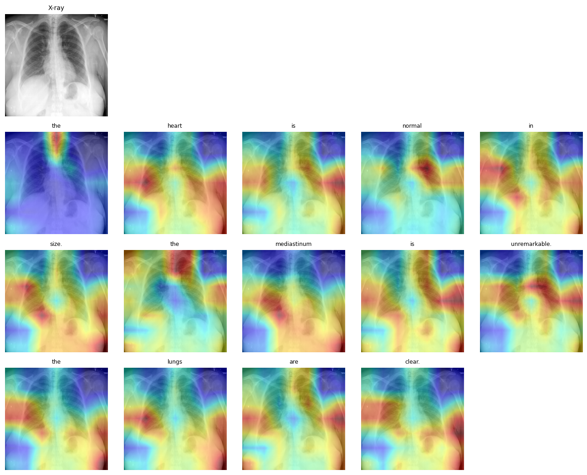
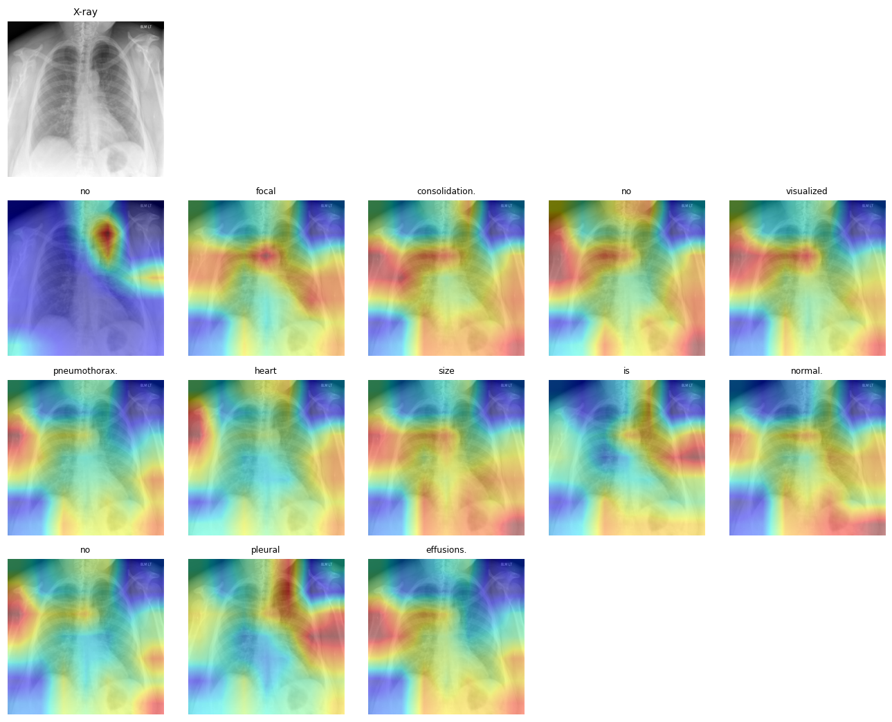
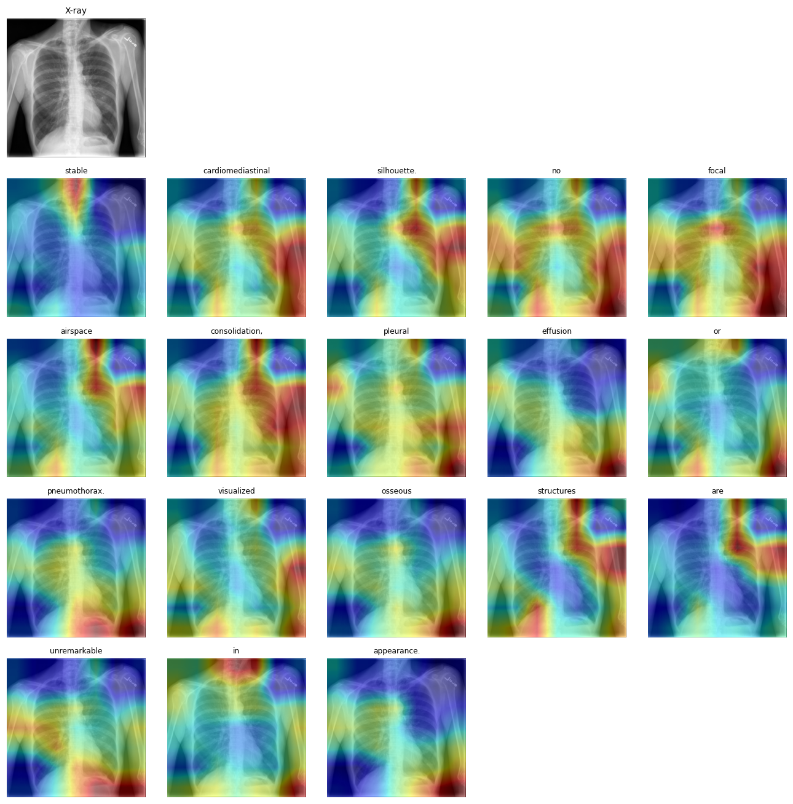

# AbdoGround

**Grounded chest X-ray report generation with visual explainability.**

AbdoGround takes a chest X-ray and generates a short radiology *findings* description,
while exposing - as an attention heatmap - which regions of the image drove each phrase
it produces. It is a proof-of-concept exploring **visual grounding** in medical
vision–language models: the problem that such models often produce fluent reports
without anchoring them to clinically relevant image regions.

> **Research prototype. Not a clinical or diagnostic tool.** Trained on a small public
> dataset and not validated for pathology detection.

---

## Why this project

Recent medical multimodal models generate plausible reports but frequently fail to ground
their predictions in the right part of the image, which limits reliability and
interpretability. AbdoGround treats grounding as a first-class output rather than an
afterthought: every generated report ships with a heatmap showing where the model attended.

It is deliberately built on **chest** X-rays as a proxy, because open paired
image–report data exists there (the IU X-ray / Open-i dataset). The same architecture is
intended to transfer to scarcer domains such as **abdominal** radiography, where paired
datasets do not yet exist.

---

## What it does

1. Upload a frontal chest X-ray.
2. A DenseNet-121 encoder + attention-LSTM decoder generates a findings paragraph.
3. The decoder's attention weights are rendered as a heatmap overlay, showing the image
   regions behind the generated text.
4. The report and heatmap can be exported as a PDF.

### System Screenshots


### Example grounding outputs

| X-ray + per-word attention |
|---|
|  |
|  |
|  |

*Warmer regions indicate where the model attended while generating each word. Grounding is
coarse (a 7×7 attention grid upsampled to image size) and qualitative - it shows where the
model looked, not radiologist-verified pathology localisation.*

---

## Results

Measured on the held-out test set (663 images the model never trained on):

| Metric | Score |
|---|---|
| BLEU-1 | 0.282 |
| BLEU-4 | 0.097 |
| ROUGE-L | 0.295 |

These are word-overlap metrics standard for report generation and are consistent with
reported baselines on IU X-ray. Note that report generation is **not** measured by
"accuracy" - there is no single correct report, so overlap-based metrics are used instead.

---

## Architecture

```
Chest X-ray (224×224, grayscale)
        │
        ▼
  DenseNet-121 encoder  ──►  7×7×1024 regional features
        │
        ▼
  Additive attention  ◄────────────┐
        │                          │ (attention weights → heatmap)
        ▼                          │
  LSTM decoder  ──►  findings text, one word at a time
```

- **Encoder:** DenseNet-121 (torchvision, pretrained), grayscale repeated to 3 channels.
- **Decoder:** LSTM with Bahdanau-style additive attention over image regions.
- **Grounding:** per-step attention weights, averaged over content words, overlaid as a heatmap.

---

## Tech stack

- **Model / training:** PyTorch, torchvision, Kaggle GPU (T4)
- **Backend:** FastAPI (single `/generate` endpoint, CPU inference)
- **Frontend:** React (Vite), client-side PDF export (jsPDF)
- **Data:** IU X-ray (Indiana University / Open-i), ~3,307 frontal image–report pairs after filtering

---

## Running locally

### Backend
```bash
cd backend
python -m venv venv
source venv/bin/activate          # Windows: venv\Scripts\activate
pip install torch torchvision --index-url https://download.pytorch.org/whl/cpu
pip install -r requirements.txt
uvicorn main:app --reload --port 8000
```

**Trained weights** (`model.pt`, ~52 MB) are not committed to git. Either:
- download them from the [latest release](../../releases) into `backend/artifacts/`, or
- set a `MODEL_URL` environment variable to the release download link, and the backend
  fetches the weights on first startup.

`vocab.json` and `config.json` are small and included in the repo.

### Frontend
```bash
cd frontend
npm install
npm run dev
```
Set `VITE_API_URL` to the backend URL (defaults to `http://localhost:8000`).

---

## Limitations

- **Proof-of-concept scale.** ~2,300 training images and short training; not a clinically
  reliable system.
- **Normal-case bias.** IU X-ray skews heavily toward normal studies, so the model tends
  toward normal-sounding reports and may miss specific pathologies.
- **Metrics measure word overlap, not clinical correctness.** Clinical-efficacy metrics
  (e.g. F1-RadGraph, CheXbert) would be needed to assess diagnostic reliability.
- **Grounding is qualitative and coarse**, not validated against radiologist annotations.
- **Chest, not abdominal** - built as a transferable proxy, not on the target domain.

## Possible extensions

- Quantitative grounding evaluation against region annotations.
- Clinical-efficacy metrics and comparison against multiple baselines.
- Replacing the LSTM decoder with a transformer / pretrained language model.
- Constructing and benchmarking on a paired abdominal X-ray dataset.

---

## Data & license

Dataset: Indiana University Chest X-rays, accessed via the NLM Open-i service
(Demner-Fushman et al., 2016). Dataset license: **CC BY-NC-ND 4.0** (non-commercial,
no-derivatives). The dataset is not redistributed here, and released weights are for
non-commercial research use only.

Code in this repository is released under the **MIT License**.

---

*Built as a research prototype exploring grounded medical report generation.*